# 🚀 AWS CI/CD Static Website Deployment

A portfolio project demonstrating how to deploy a static website to AWS using **S3, CloudFront, and GitHub Actions** for full CI/CD automation.

---

## 📌 Project Overview

This project showcases how to:

* Host a static website on **Amazon S3**
* Deliver content globally using **CloudFront**
* Automate deployments with **GitHub Actions**
* Structure a clean, production-ready repository

The goal was to move from manual uploads to a fully automated deployment pipeline.

---

## 🧱 Architecture

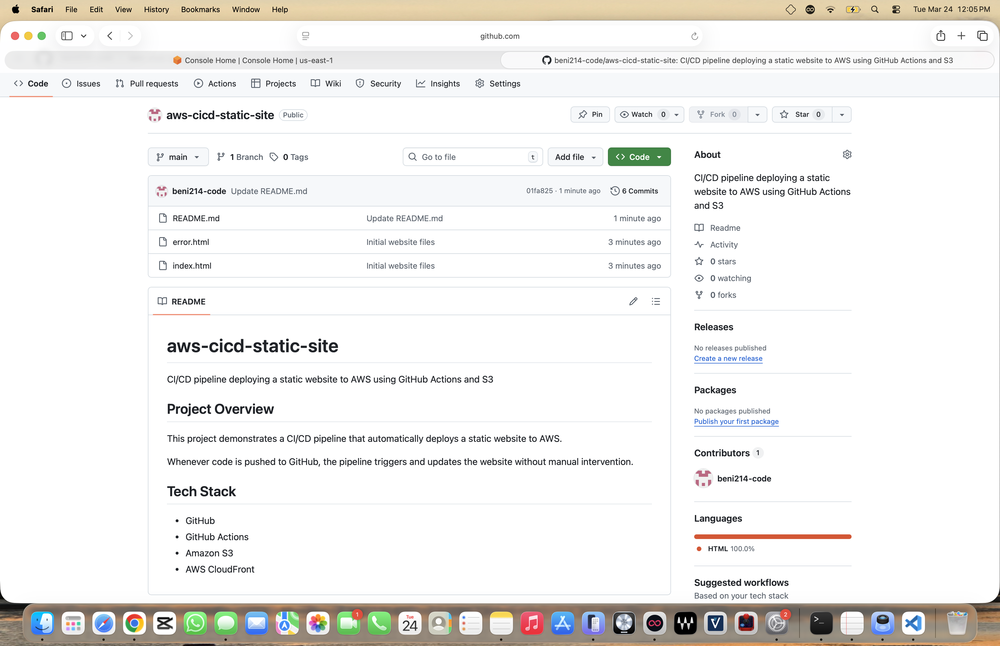

---

## ⚙️ Technologies Used

* **AWS S3** – Static website hosting
* **AWS CloudFront** – CDN for global delivery
* **GitHub Actions** – CI/CD pipeline automation
* **IAM** – Secure deployment permissions
* **HTML/CSS** – Static website

---

## 🔄 CI/CD Pipeline

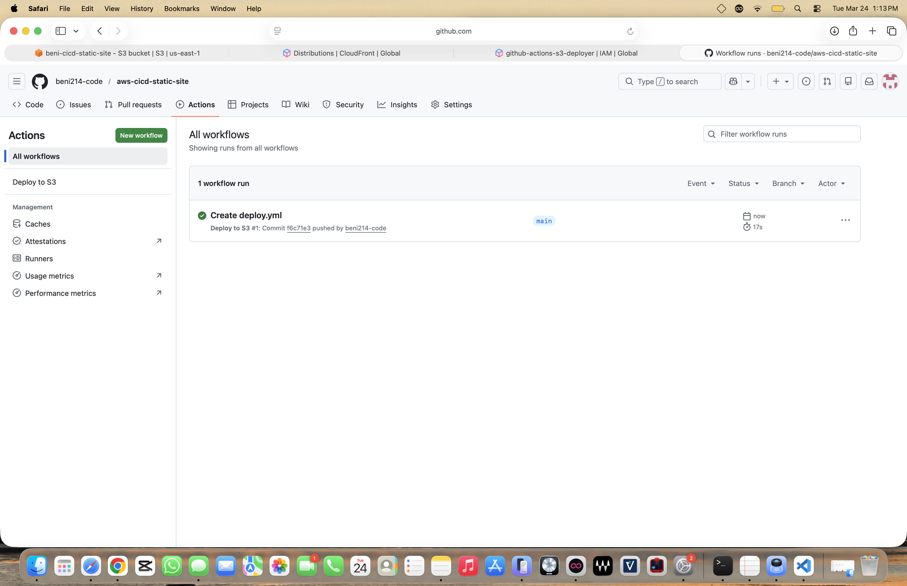

### Pipeline Flow:

1. Code is pushed to GitHub
2. GitHub Actions workflow is triggered
3. Files are deployed to S3
4. CloudFront cache is refreshed
5. Website updates automatically

---

## 🧭 Project Walkthrough

### 1. Initial Repository Setup

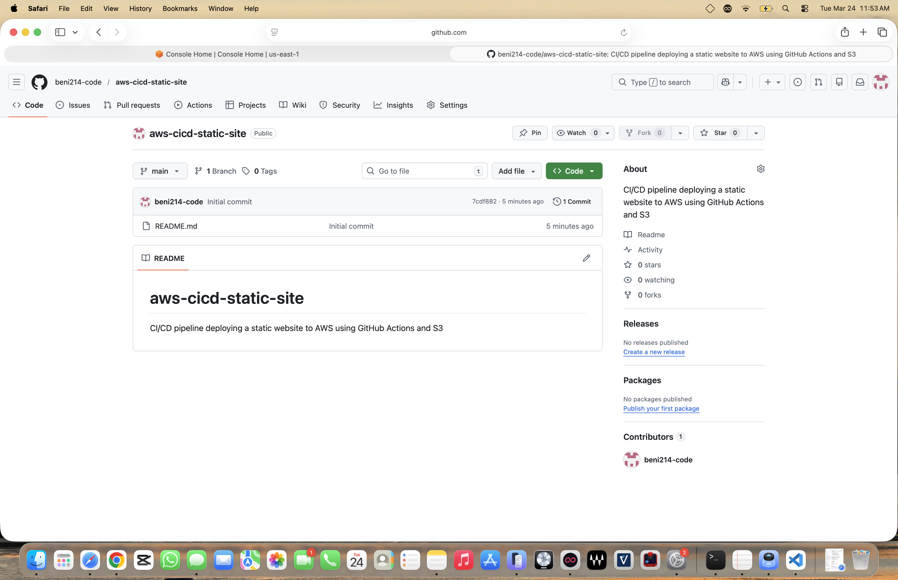

### 2. Files Uploaded to Repository

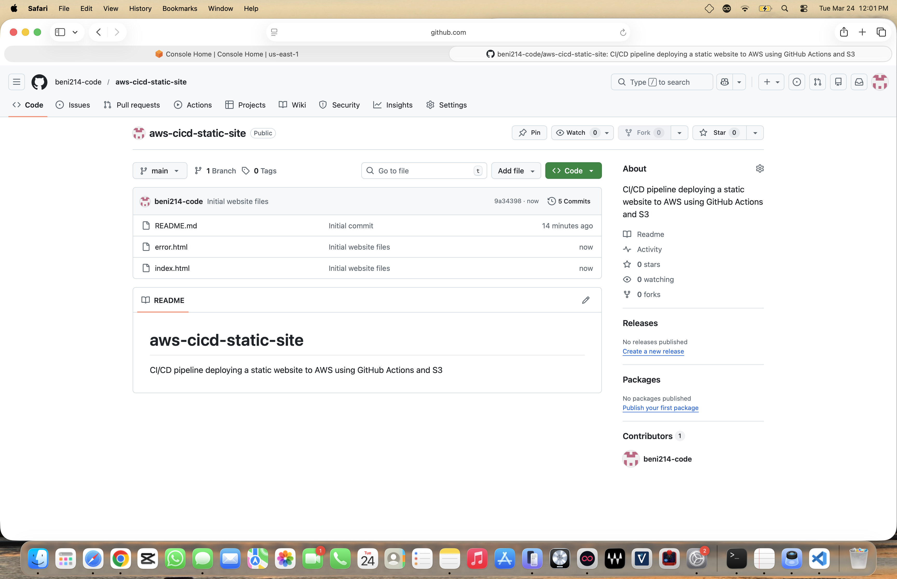

---

### 3. S3 Bucket Created

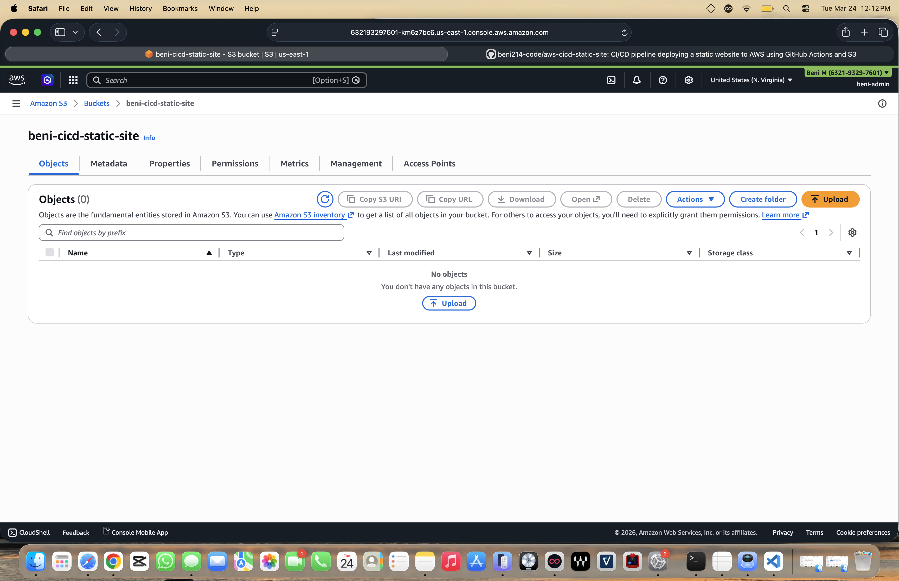

### 4. Files Uploaded to S3

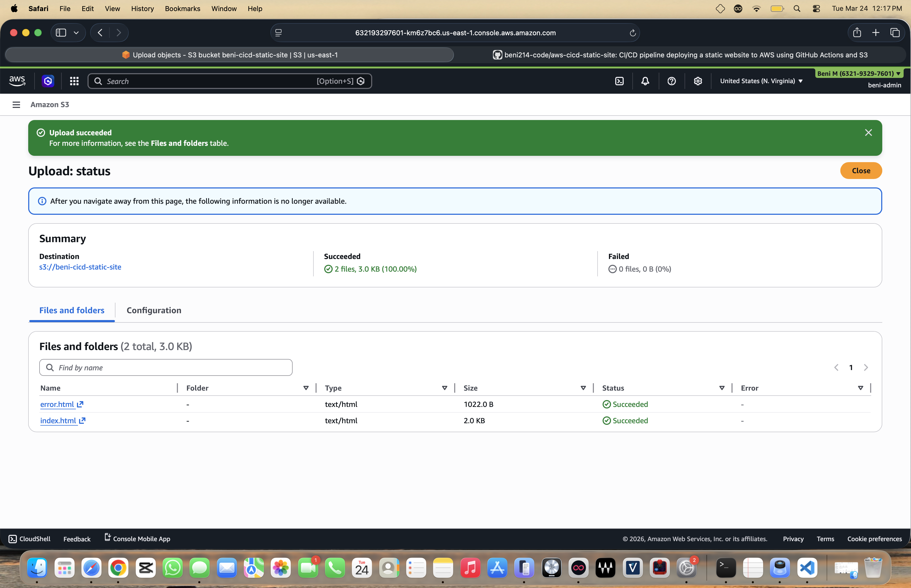

### 5. Static Website Hosting Enabled

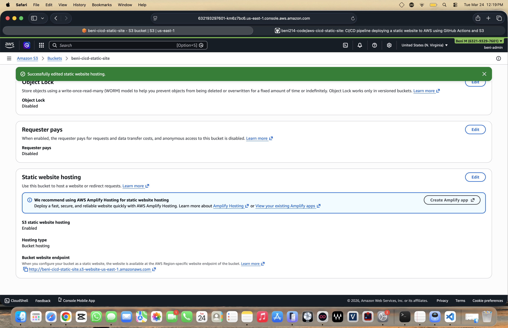

### 6. Bucket Policy for Public Access

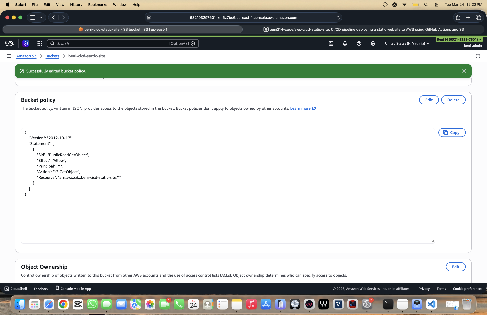

### 7. Website Live via S3 Endpoint


---

### 8. CloudFront Distribution Created

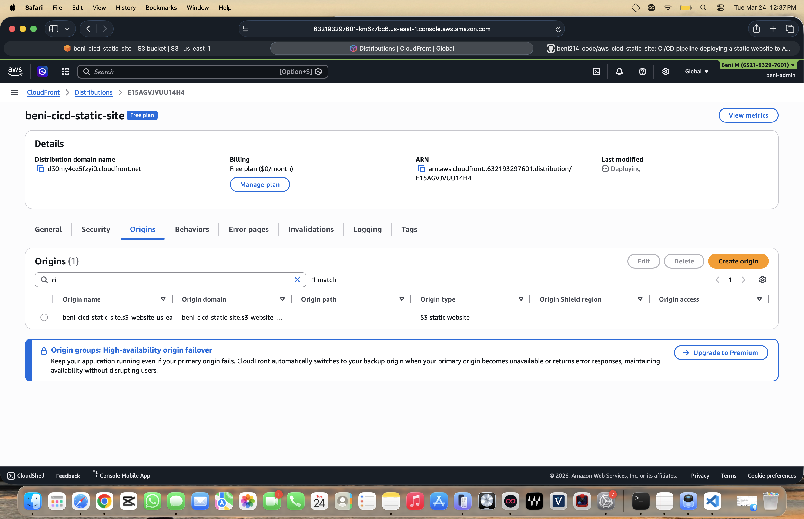

### 9. Website Live via CloudFront (CDN)


---

### 10. IAM User Created

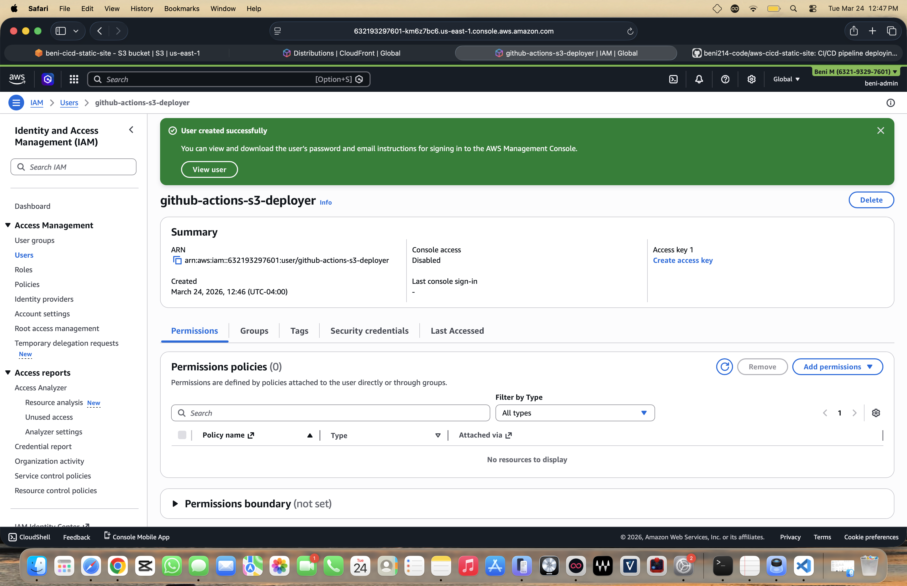

### 11. IAM Policy Configured

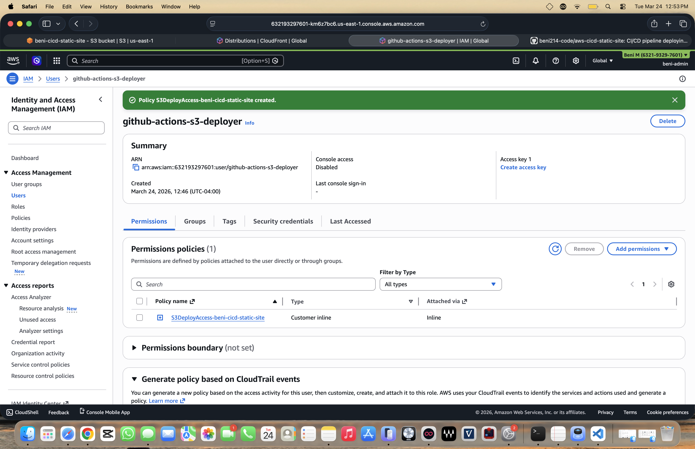

### 12. Access Keys Generated

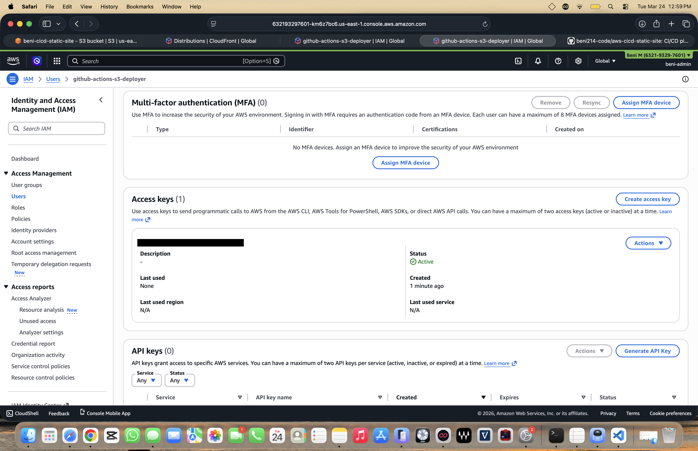

---

### 13. GitHub Secrets Configured

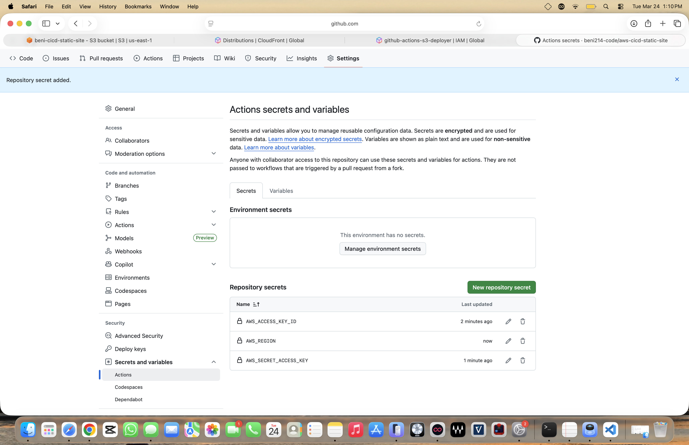

### 14. CI/CD Pipeline Successful Deployment


---

### 15. Final Deployed Portfolio Site

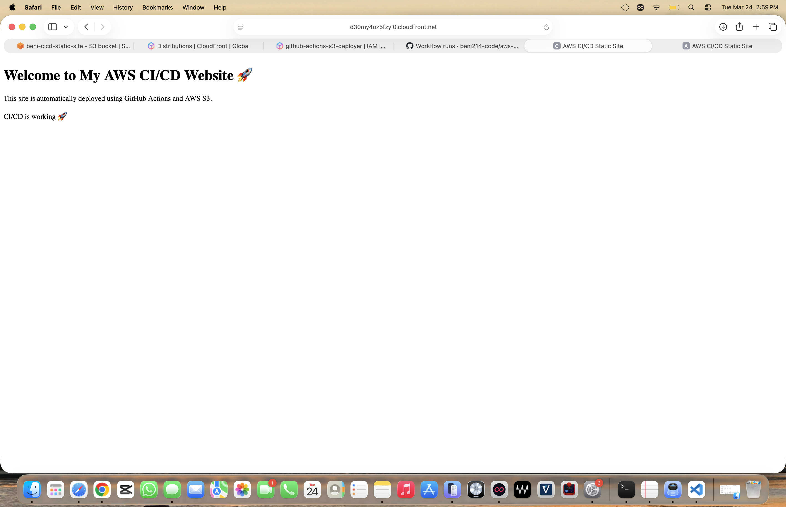

---

## 📂 Repository Structure

```id="repo-structure"
aws-cicd-static-site/
│
├── .github/workflows/   # CI/CD pipeline
├── Site/                # Website files
├── images/              # Project screenshots
├── index.html
├── error.html
└── README.md
```

---

## 🌍 Live Demo

🔗 https://d30my4oz5fzyi0.cloudfront.net

---

## 🎯 Key Learnings

* Built a fully automated deployment pipeline
* Learned how to integrate AWS with GitHub Actions
* Understood CDN behavior and cache invalidation
* Practiced real-world DevOps workflows

---

## 🚀 Future Improvements

* Add custom domain (Route 53)
* Enable HTTPS with ACM
* Add monitoring/logging
* Improve UI/UX design

---

## 👤 Author

**Beni Mulugeta**

Building cloud and DevOps projects while transitioning into a tech career.
